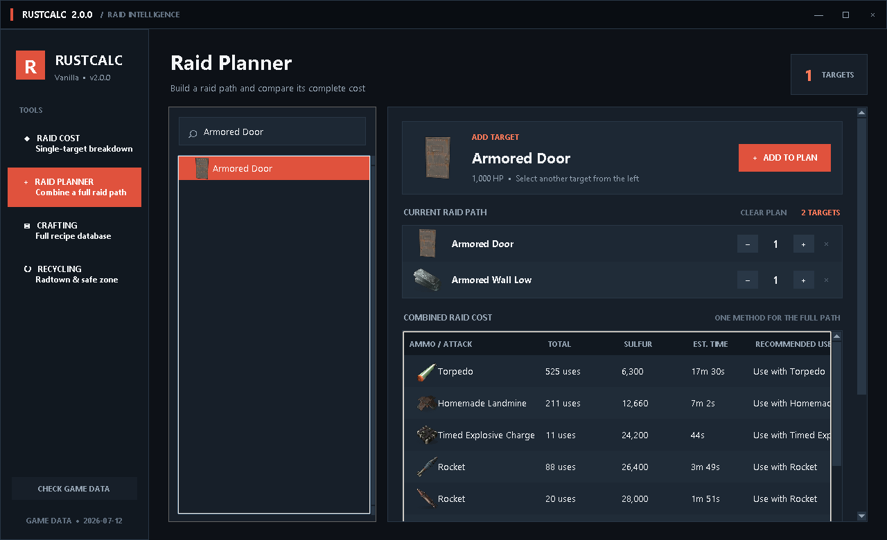
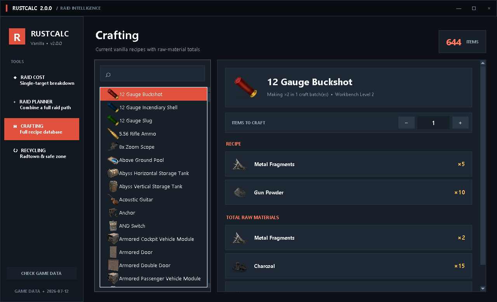

# RustCalc

RustCalc is a Windows desktop companion for Rust that provides searchable raid costs, full raid-path planning, crafting calculations, and recycling estimates using an offline item and icon database.



## Features

- Searchable raid costs for building pieces and deployables
- Multi-target raid planner with combined ammunition, sulfur, and time estimates
- Quantity-aware crafting recipes and raw-material totals
- Radtown and safe-zone recycling calculations
- Embedded offline icons and persistent raid plans
- Automatic game-data update checks



## Installation

1. Open the [latest release](../../releases/latest).
2. Download `RustCalc-Setup-2.0.0.exe`.
3. Run the installer. It creates Start Menu and desktop shortcuts.
4. Launch RustCalc from either shortcut.

RustCalc currently uses an unsigned installer. Windows SmartScreen may show a warning for a newly published application. Confirm that the filename and release source are correct before running it.

## Requirements

- Windows 10 or Windows 11, 64-bit
- No Python installation required
- Internet access is only needed when checking for game-data updates

## Version

Current release: **2.0.0**

Installer SHA-256:

```text
D30C731FC6B6BEDA59509913DFDA53F3367BB18555D129641C1C4FDDF568A127
```

## Disclaimer

**RustCalc is an unofficial Rust companion and is not affiliated with, endorsed by, or sponsored by Facepunch Studios.** Rust and related trademarks and game assets belong to their respective owners.
